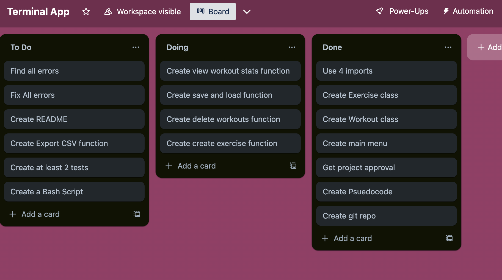

T1A3 - Terminal Application
Name: Malcolm Andrews
Presentation Link: https://youtu.be/JPvXhrcdFL0
Github Repo: https://github.com/MalcolmKAA/terminalapp 

Three Features:

1. Workout and exercise creation
The program allows the user to create custom workouts with custom exercises. The user can create and name a workout then assign exercises to the workout, selecting how many sets, reps to complete and rest time at a given weight. The program also allows the user to select a value to increase the weight by each time an exercise within a workout has been completed, allowing the user to progress over time with their training.
2. Executing workouts
The program allows users to execute a workout and progress through the workout set by set and exercise by exercise. The program makes use of 'from time import sleep' python import to delay the start of each set by a user specified amount of time, allowing the user to accurately rest the accurate amount of time between each set. If the user successfully completes an exercise, the program will automatically increase the weight of the exercise the next time the user attempts the workout by the amount the user specified when making the program. If the user fails a set, the program will ask the user if they would like to decrease the weight. A failure will also ensure the weight is not increased on the next attempt of the workout.
3. Recording stats
The program make suse of the datetime module to record the date and time a workout was executed. Using this information, it will store the highest weight achieved within a stats function. This allows the user to view what their highest lift is so far, and the time and date they achieved this milestone. The user can also export the data of their stats in a CSV file to do with as they please.

Implementation Plan

1. Use pseudocode to make a rough guide for loops, functions, and classes.

Figure out what problem the software is solving for the user. Decide what kind of classes, functions and loops will be needed.

2. Create classes loops and functions.

Start with a basic skeleton of how the program will function and add the expected classes, loops and functions that will be needed. Then build the classes, functions and loops prioritizing in the following order; creating the workouts exercises, executing the workouts, stats, and finally exporting to csv .

3. Routinely check user inputs to find errors.

Try to crash the program by entering information into the user inputs that the program would not be prepared to deal with. eg entering a string into a input prompt that's expecting an integer. Once errors are found, implement conditional statements to handle the errors.

4. Create tests that will test the core functionality of the program 

Create a test that will test the core functionalities of the program; creating workouts and exercises, and then executing them.

5. Finalize the code

Check for any last errors or bugs. Make sure the code is clear, easy to read and makes sense.

6. Create a bash script

Create a bash script containing multiple scripts that will check whether a computer is running the correct version of python, then create the correct virtual environment for the program to run. The script will then run the tests to ensure core functionalities are working, then finally make the program executable and run the program

Trello was used to track progress as seen in this screenshot 

 Help Documentation

Installation:

Python 3.8 must be installed on your system.
Download the files from the Git repo.
Run the main_script.sh in terminal by navigating to the directory the downloaded files are kept in.
The script will ensure the correct version of Python is running, run some tests to ensure the program is working as it should, then make the main.py file executable then finally running it.

Dependencies: 

This requires Python 3.8 or higher to run, and only uses standard Python libraries.

Using the Application:

From the menu, select '1' to create a workout, then follow the prompts. 
Then from the menu select '2' and follow the prompts to execute the workout.
Once the workout is complete, you can select '3' from the menu to view your stats.
You can also select '4' from the menu to export your stats as a CSV file.
Selecting '5' from the menu will allow you to delete previously created workouts.
Finally, selecting '6' will save and exit the program.
